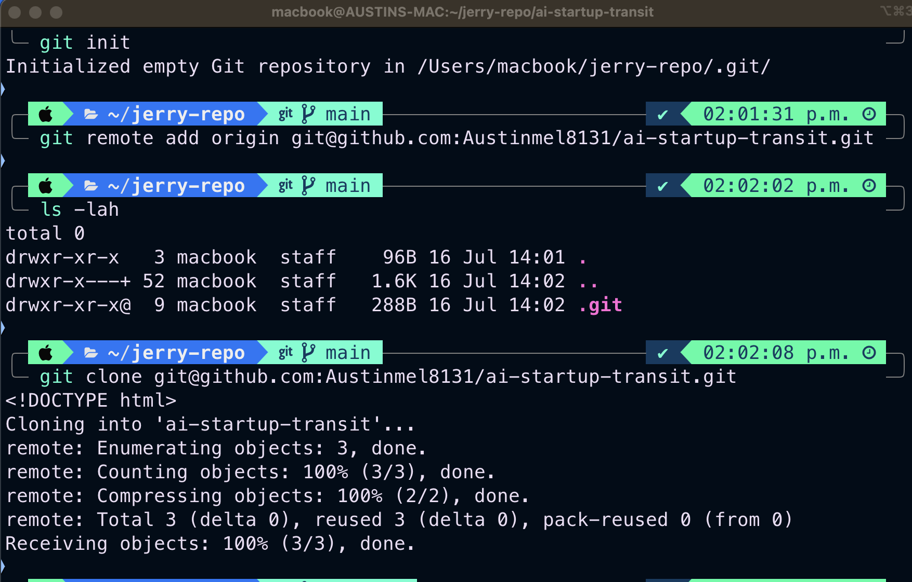
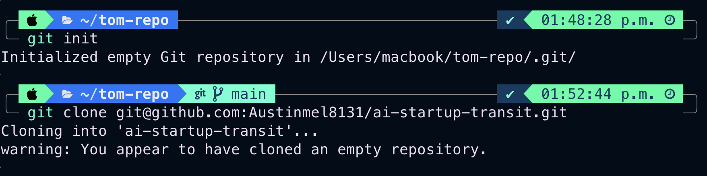

# Git Version Control Basic using Github for a Startup company using different branch, creating pull request and working on same index file simulteneously to update different codes

# Jerry cloning remote repo called ai-startup-transit(https://github.com/Austinmel8131/ai-startup-transit)

# Jerry making a new branch (add-contact-info)

# Jerry updtaing the footer with contact-info in the index.html file using vim eidtor, then adding the file to git using "git add index.html" then making a commit with commit message before pushing it to remote repository

# Jerry creating a pull request (PR)

# Merging PR to

# Tom cloning remote repo

# Tom making a new branch

# Tom updtaing the navigation bar in the index.html file  using vim eidtor, then adding the file to git using "git add index.html" then making a commit with commit message before pushing it to remote repository

# Tom creating a pull request (PR)

# Merging PR to main

# full code review of index.html file 

